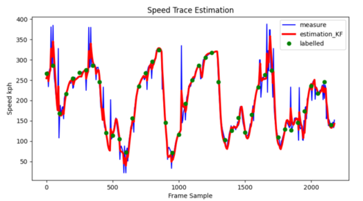
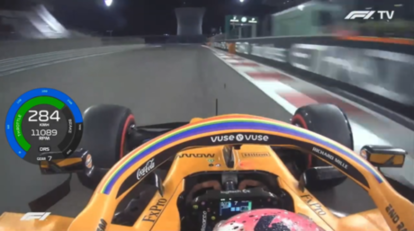

# Speed Trace Estimator
This tool estimates the speed trace form the virtual dashboard on the Onboard Video, using Computer Vision and Machine Learning techniques.

---

## Overview

The software is composed by the following classes:

1. **BoundingBox.py**
	- apply an Otsu filter
	- compute contour on each digit
	- apply a bounding box on each contors
	- return a gray scale image of each digit

2. **Classification_MNIST.py**
	- load and Scale the MNIST database
	- split the database in training and test sets
	- fit classifier model (KNN, DT, RandomForest or SVM)

3. **SpeedTraceEstimator.py**
	- this is the main algorithm pipeline
	- read a video (onboard video with digital dashboard)
	- apply ROI around the speed for each image frame
	- extract each digit for each image with the BoundingBox
	- apply border and rescale image to 28x28 (as per MNIST)
	- predict each digit with Classifier and concat the digits
	- apply a Linear Kalman Filter on the speed estimation

If given a labelled data array it will be printed the Mean Absolute Error between the estimation and the groud truth data.

--- 

## Guide

To use the software change directory to src/, then open SpeedTraceEstimator.py and define the input parameter for the istance of the class at the bottom of the file (name of the video, downsamplign etc).
Then just run that class.
